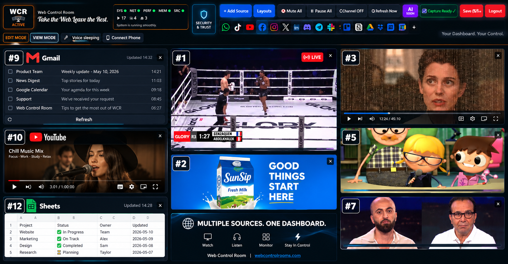

# Web Control Room (WCR)

### A customizable web control room for live channels, internet radio, widgets, websites, monitoring and more — all in one dashboard.

🌐 **Official website:** [webcontrolrooms.com](https://webcontrolrooms.com)

---

## What is Web Control Room?

**Web Control Room (WCR)** is a customizable browser-based dashboard that brings multiple information and media sources together on one screen.

Instead of constantly switching between browser tabs, windows and apps, WCR lets you create your own visual **control room dashboard** for watching, listening, monitoring and organizing the sources that matter to you.

Use one workspace for **live channels, internet radio, widgets, web content, monitoring sources and more**.

No installation is required for the core web experience, and you can start using Web Control Room as a guest without creating an account.

👉 **[Open Web Control Room](https://webcontrolrooms.com)**

---

## Live TV, IPTV & Multi-Channel Viewing

If your problem is not finding one stream but **keeping several live sources visible at the same time**, WCR is designed around that workflow.

Use the multi-tile dashboard to organize supported **live TV channels, IPTV-style live sources, news feeds and video streams** into one visual workspace. Tiles can be arranged and resized in Edit Mode, making WCR useful as a browser-based **multi-stream viewer, live-channel dashboard, media wall or monitoring screen**.

WCR does not provide or resell an IPTV subscription. Source availability depends on the underlying provider, region, browser and stream. The purpose of WCR is to give supported sources a flexible multi-view interface.

**Explore:** [Live Channels](https://webcontrolrooms.com/live-channels)

---

## One Screen. Multiple Sources. Your Control Room.

Web Control Room is designed for situations where one browser tab is not enough.

Build a dashboard that can combine:

- 📺 **Live channels and video sources**
- 📻 **Internet radio stations**
- 🧩 **Widgets**
- 🌐 **Web content and captured website regions**
- 📰 **News and monitoring sources**
- 📊 **Information panels**
- 🎙️ **Voice control**
- 📱 **Phone remote control**
- 🔌 **Connected services**

Arrange everything into a workspace that fits the way you monitor information.

---

## Key Features

### 📺 Live Channels

Browse a large catalog of live channels and video sources and bring selected sources into your dashboard.

Web Control Room is designed to make following multiple live sources easier without constantly moving between separate browser tabs.

**Explore:** [Live Channels](https://webcontrolrooms.com/live-channels)

> Availability can vary by source, region, browser and streaming provider.

---

### 📻 Internet Radio

Discover internet radio stations from around the world and keep radio alongside the rest of your control room.

Use WCR as an **internet radio dashboard** while keeping other information visible on the same screen.

**Explore:** [Live Radio](https://webcontrolrooms.com/live-radio)

> Individual station availability can change over time.

---

### 🧩 Widgets

Add useful widgets directly to your dashboard.

WCR supports built-in information and utility widgets, allowing your control room to contain more than just media.

**Explore:** [Widgets](https://webcontrolrooms.com/widgets)

---

### ↔️ Moveable & Resizable Dashboard

Your control room is not a fixed page.

Enter Edit Mode to move and resize dashboard panels and create a layout around the information you want to see.

Build a compact monitoring dashboard, a media wall, or your own personal command center.

---

### 🖥️ Multiple Sources in One Workspace

Web Control Room is built around a multi-tile workspace where different types of sources can live together.

Website capture tools can also bring selected web content into the control room.

Because websites use different embedding and browser security policies, website behavior can vary by source.

**Learn more:** [Multiple Websites](https://webcontrolrooms.com/multiple-websites)

---

### 🎙️ Voice Control

Control supported WCR actions using voice commands.

The goal is simple: interact with your control room without having to manually click through every control.

**Learn more:** [Voice Control](https://webcontrolrooms.com/voice-control)

> Voice control requires browser microphone permission and browser support.

---

### 📱 Phone Remote

Turn your phone into a remote control for an open Web Control Room session.

Pair your phone with WCR and control supported actions without returning to the computer every time.

**Learn more:** [Phone Remote](https://webcontrolrooms.com/phone-remote)

---

### 🔌 Integrations

Web Control Room can connect supported online services to the dashboard environment.

Google is currently the primary public integration, with supported Google services available through WCR widgets and connected experiences.

Additional integrations are planned as the platform develops.

**Explore:** [Integrations](https://webcontrolrooms.com/integrations)

---

### 🧠 AI Control — Coming Soon

Natural-language AI control is under development.

The goal is to make interacting with a complex control room as simple as describing what you want it to do.

**Preview:** [AI Control](https://webcontrolrooms.com/ai-control)

---

## Browser-Based Control Room

The core Web Control Room runs directly in your browser.

You do **not** need to install the main application to use core features such as live channels, internet radio, widgets, voice control and phone pairing.

For advanced webpage capture and refresh workflows, optional capture components are available separately.

---

## WCR Capture

**WCR Capture** extends Web Control Room with webpage capture capabilities.

It can be used to bring selected regions of webpages into your control room and support advanced capture workflows.

**Learn more:** [WCR Capture](https://webcontrolrooms.com/extension)

**Setup:** [WCR Setup Center](https://webcontrolrooms.com/setup)

---

## Guest Mode & Accounts

You can start using Web Control Room without creating an account.

### Guest

Guest users can explore and build a temporary control room directly in the browser.

Guest layouts are temporary and are not intended as permanent cloud storage.

### Registered User

Signing in enables persistent account-based experiences, including saved control room layouts.

This lets you return to your workspace instead of rebuilding it each time.

---

## What Can You Build With WCR?

### 📰 Live News Dashboard

Keep several news and information sources visible in one monitoring workspace.

### 📺 Multi-Stream Dashboard

Organize live channels and video sources into a single visual control room.

### 📻 Internet Radio Dashboard

Keep radio stations available alongside websites, widgets and other sources.

### 🌐 Website Monitoring Dashboard

Use supported web and capture workflows to keep important online information visible.

### 📊 Information Dashboard

Combine widgets, media and monitoring sources into a customized information screen.

### 🖥️ Personal Command Center

Build a browser-based command center around the sources and tools you use every day.

### 🎬 Creator & Streaming Workspace

Keep useful media, information and monitoring sources together while working or streaming.

---

## Common Questions

### Can I watch multiple live channels at once?

WCR is built around a multi-tile dashboard, so supported live and video sources can be kept together in one workspace instead of separate browser tabs. Actual playback depends on each source and its provider.

### Is Web Control Room an IPTV provider?

No. WCR is a dashboard and multi-view interface, not an IPTV subscription seller. It organizes supported live sources and channels into a customizable control-room layout.

### Can I build a video wall or monitoring wall?

Yes. Moveable and resizable tiles make it possible to build layouts for multi-stream viewing, news monitoring, media monitoring and information-heavy workspaces.

### Can I use WCR for multitasking?

Yes. WCR is specifically useful when your workflow normally requires many browser tabs, windows or information sources to remain visible at once.

### Do I need an account to try it?

No. Guest access is available for trying and building a temporary control room. Signing in enables persistent account-based experiences such as saved layouts.

---

## Who Is Web Control Room For?

WCR can be useful for:

- News watchers
- Stream viewers
- Internet radio listeners
- Researchers
- Content creators
- Streamers
- Power users
- Multi-monitor users
- Monitoring workflows
- Media monitoring
- Information-heavy workspaces
- People who regularly keep many browser tabs open
- Anyone who wants a customizable browser dashboard

---

## Why Web Control Room?

A normal browser workflow often looks like this:

**Open tab → switch tab → find window → switch app → repeat.**

Web Control Room approaches the problem differently.

Instead of adapting yourself to dozens of separate tabs and windows, you create one visual workspace around the information you want to see.

The result is a customizable **web dashboard**, **monitoring dashboard**, **media dashboard** and **control room interface** in one environment.

---

## Public Product Pages

| Feature | Page |
|---|---|
| Web Control Room | [webcontrolrooms.com](https://webcontrolrooms.com) |
| Live Channels | [Live Channels](https://webcontrolrooms.com/live-channels) |
| Internet Radio | [Live Radio](https://webcontrolrooms.com/live-radio) |
| Widgets | [Widgets](https://webcontrolrooms.com/widgets) |
| Multiple Websites | [Multiple Websites](https://webcontrolrooms.com/multiple-websites) |
| WCR Capture | [Extension](https://webcontrolrooms.com/extension) |
| Voice Control | [Voice Control](https://webcontrolrooms.com/voice-control) |
| Phone Remote | [Phone Remote](https://webcontrolrooms.com/phone-remote) |
| Integrations | [Integrations](https://webcontrolrooms.com/integrations) |
| AI Control | [AI Control](https://webcontrolrooms.com/ai-control) |
| Security & Trust | [Security](https://webcontrolrooms.com/security) |
| Privacy | [Privacy](https://webcontrolrooms.com/privacy) |
| Setup Center | [Setup](https://webcontrolrooms.com/setup) |

---

## Feedback & Feature Requests

Web Control Room is actively being developed.

Feedback, bug reports and feature suggestions are welcome.

If you use WCR and find something that could be improved, open an issue in this repository and tell us:

- What you were trying to do
- What happened
- What you expected
- What would make WCR more useful for you

---

## Official Links

🌐 **Web Control Room:**  
https://webcontrolrooms.com

🧩 **Setup Center:**  
https://webcontrolrooms.com/setup

🔒 **Security & Trust:**  
https://webcontrolrooms.com/security

📄 **Privacy:**  
https://webcontrolrooms.com/privacy

---

## About This Repository

This is the public product information, documentation and feedback repository for **Web Control Room (WCR)**.

The production application source code is **not published in this repository**.

This repository is intended for:

- Product information
- Public documentation
- Screenshots and demos
- Feature information
- Usage guides
- Product updates
- Bug reports
- Feature requests
- Community feedback

---

## Web Control Room

**Bring your sources together. Build your control room.**

👉 **[Launch Web Control Room](https://webcontrolrooms.com)**
